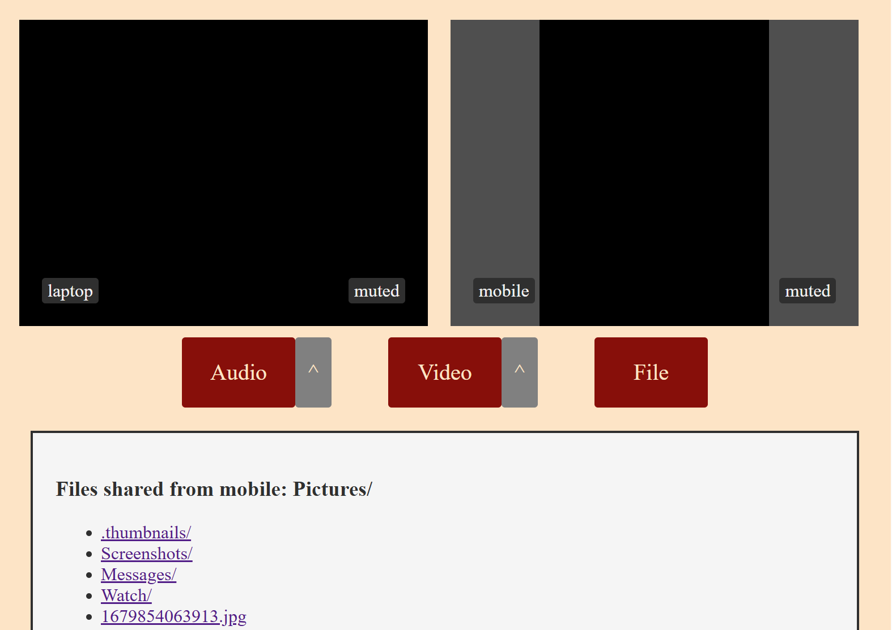

# Sidebar

Sidebar lets you have video meetings and secure file sharing in your browser, directly between peers without having data pass through a central server.



There is a server that sends and receives a small amount of traffic to help clients find each other, but all video, audio, and data content is sent directly from peer to peer and is end-to-end encrypted with [DTLS](https://en.wikipedia.org/wiki/Datagram_Transport_Layer_Security).

### Quick start

To get the server up and running:

```shell
$ npm install
$ node server.js
```

Then visit http://localhost:2025 in your browser. The username will be your display name and the password comes from the `SIDEBAR_PASSWORDS` environment variable (defaults to `a`).

### Server details

Because the server doesn't handle much traffic, it can handle many password-protected rooms simultaneously, and can easily be self-hosted. Clients on separate NATs can connect to each other directly as long as the server is reachable by both clients. One option for making a self-hosted server publicly reachable with HTTPS is to use something like [Tailscale Funnel](https://tailscale.com/kb/1223/funnel).

Passwords are comma separated and loaded from the `SIDEBAR_PASSWORDS` environment variable.

### Client details

The browser's [WebRTC](https://webrtc.org/) implementation does most of the work of video and audio capture and streaming.

Clients can share a directory to connected peers, who can browse sub-folders and download content. This is a great way to [share content between devices that might otherwise have difficulty connecting to each other](https://xkcd.com/949/), like a laptop and a mobile device. Because this takes place over WebRTC data channels it is not as fast as traditional server to client downloads, due to limitations in message size as well as requiring UDP for NAT traversal instead of using TCP.

Smartphones and tablets work as well as larger computing devices.

The number of clients that can share a room depends on how much bandwidth the clients have. You can easily have a room with 5+ people.